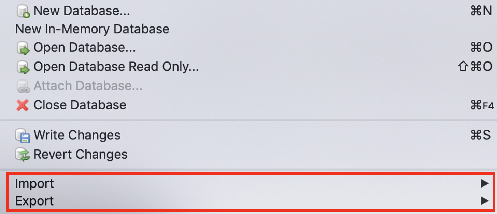
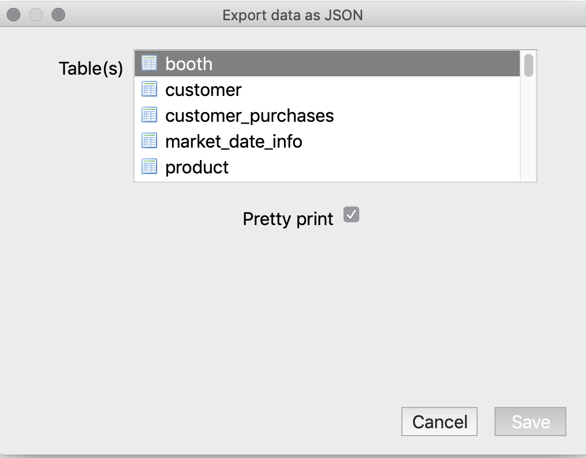
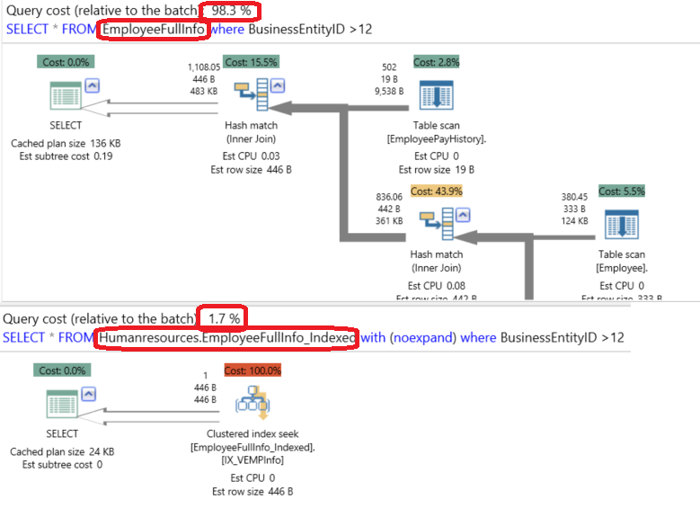

# Advanced SQL Techniques: Manipulation, Integration, and Optimization

```
$ echo "Data Sciences Institute"
```

---

# Expanding your Database:

## $\rightarrow$ INSERT, UPDATE, DELETE

## Importing and Exporting Data

## CROSS & Self Joins

## Views

---


# INSERT, UPDATE, DELETE

Prior to this, we've focused solely on retrieving values from tables:
- Tables can also be manipulated with `INSERT`, `UPDATE`, and/or `DELETE`
- _A word of warning...these commands are PERMANENT_ `r structure("\U1F631", class = "emoji")`
  - Generally, follow a policy that avoids altering data 
  - Make backups of tables before you run a query
  - Never hurts to test on a temporary table first!
  
- But they are useful, and sometimes the correct solution
- There is no `SELECT` statement for these types of queries

---

# INSERT
- `INSERT` allows you to add a record
- Specify where you want to add:
  - `INSERT INTO [some_table_name]`
- ...and what you want to add:
  - `VALUES(column_one_value, column_two_value)`
- `VALUES` come in the order of the columns within the tables
- `VALUES` must respect table constraints
  - e.g. NULLs, UNIQUE, data types, etc
- `INSERT` can help create small helper tables
  - **Can we think of any scenarios?**

---

# UPDATE
- `UPDATE` allows you to change a record
- Specify where you are making your change:
  - `UPDATE [some_table_name]`
- ...and what you want to change:
  - `SET column_one = value1, column_one = value2`
- _SPECIFY A_ `WHERE` _CONDITION_
  - `WHERE condition`
- You can change a single column, a few columns, all the columns, etc
  - (Respecting table constraints)
- **What happens if you don't specify a WHERE condition?**

---


# DELETE
- `DELETE` allows you to remove a record
- Specify where you want to delete:
  - `DELETE FROM [some_table_name]`
- _SPECIFY A_ `WHERE` _CONDITION_
  - `WHERE condition`
- **What happens if you don't specify a WHERE condition?!?**
- `DELETE` doesn't _remove_ a table from a database
  - Instead it removes the data from it, leaving the table structure and constraints in place
      - `DROP TABLE` instead if you want to remove it altogether

---


# INSERT, UPDATE, DELETE

(`INSERT`, `UPDATE`, `DELETE` live coding with a TEMP TABLE)

---

# What questions do you have about INSERT UPDATE DELETE?

---


# Expanding your Database:

## INSERT, UPDATE, DELETE

## $\rightarrow$ Importing and Exporting Data

## CROSS & Self Joins

## Views

---


# Import & Export
- RDBMs allow data to flow into and out of them
  - Some processes are easy:
      - e.g. exporting a table as a CSV file
  - ...while others are complex
      - e.g. writing a CRM to a normalized data warehouse on a nightly basis
- In DB Browser for SQLite, we can make use of the following:
  - Import and export CSV files
  - Manipulate and export JSON files
- SQLite more broadly can:
  - Produce CSVs from queries (using the command line, which we won't do)
  - Connect to other programming languages

---

# CSV
- CSV stands for "Comma Separated Values"
- CSVs are file formats well designed to store SQL tables
  - The values of each row are separated by commas
      - Sometimes it makes more sense to use a "|" (pipe), if there is complex text data stored, which might be more sensitive to the presence of commas and/or line breaks
- They are a common file format for transporting structured data 
- CSVs can be opened by:
  - Excel
  - Simple text editors (e.g. notepad++, sublime)
  - Programming languages (e.g. python, R)


---

# CSV

DB Browser for SQLite natively supports CSV importing and exporting for tables:



You can also export queries if they are stored in Temporary Tables

---


# CSV
DB Browser for SQLite allows us to extract a query result in a somewhat roundabout method:
- First, write a query
```
    SELECT * FROM product p
    JOIN product_category pc ON p.product_category_id = pc.product_category_id
```
- Second, right click the results, and select "Copy as SQL"

---
# CSV

- Third, instantiate a table with `CREATE`
```
CREATE TABLE "example" ("product_id", "product_name", "product_size", 
"product_category_id", "product_qty_type", "product_category_name") ;
```

- Fourth, paste the results from your clipboard
```
INSERT INTO "example" ("product_id", "product_name", "product_size", 
"product_category_id", "product_qty_type", "product_category_name") 
VALUES ('1', 'Habanero Peppers - Organic', 'medium', '1', 'lbs', 'Fresh Fruits & Vegetables');
...etc for each row
```
- Finally, export the table to CSV

---

# CSV

We can also extract a query result to CSV with python:

```
import pandas as pd
import sqlite3

#set your location, slash direction will change for windows and mac
DB = '/Users/thomas/Documents/GitHub/DSI_SQL/SQL/FarmersMarket.db' 

#establish your connection
conn = sqlite3.connect(DB, isolation_level=None,
                       detect_types=sqlite3.PARSE_COLNAMES)
                       
#run your query, use "\" to allow line breaks
db_df = pd.read_sql_query("SELECT p.*,pc.product_category_name \
                          FROM product p \
                          JOIN product_category pc \
                             ON p.product_category_id = pc.product_category_id"
                          ,conn)

#save
db_df.to_CSV('database-py.CSV', index=False)
```

---


# CSV

(CSV live importing/exporting)

---

# JSON

- JSON stands for "JavaScript Object Notation"
- JSONs are file formats well designed to store tables, lists, arrays, and nested objects
  - Their syntax follows specific rules:
      - Data is in name/value pairs
      - Data is separated by columns
      - Curly brackets '{ }' hold objects
      - Square brackets '[ ]' hold arrays
---
# JSON

  -  e.g. `{"first_name":"Thomas", "last_name":"Rosenthal"}`
  - or for tables: 
```
    [ {"first_name":"A", "last_name":"Mahfouz"}
        {"first_name":"Thomas", "last_name":"Rosenthal"} ]
```

- JSON can be opened by:
  - Web browsers
  - Simple text editors (e.g. notepad++, sublime)
  - Programming languages (e.g. python, R)
- SQLite also provides support for JSON value query and manipulation

---

# JSON

DB Browser for SQLite supports a lot of JSON functions:
  - Some are helper functions:
    - `JSON` and `JSON_VALID`, which confirm whether or not a string is JSON and/or in a valid JSON format
    - `JSON_TYPE`
      - When using extracting, type will help to inform column types that SQL will assume, based on the JSON
  - Other functions can be used for manipulation or extraction:
  - `JSON_EXTRACT` will allow you to return the values of a well-formed JSON string into desired parts
    - Importing JSON into SQL will use either `JSON_EXTRACT` or `JSON_EACH`

---

# JSON
  - SQLite gives the following (fairly comprehensive) example set:
```
      - `json_extract('{"a":2,"c":[4,5,{"f":7}]}', '$')` → '{"a":2,"c":[4,5,{"f":7}]}'
      - `json_extract('{"a":2,"c":[4,5,{"f":7}]}', '$.c')` → '[4,5,{"f":7}]'
      - `json_extract('{"a":2,"c":[4,5,{"f":7}]}', '$.c[2]')` → '{"f":7}'
      - `json_extract('{"a":2,"c":[4,5,{"f":7}]}', '$.c[2].f')` → 7
      - `json_extract('{"a":2,"c":[4,5],"f":7}','$.c','$.a')` → '[[4,5],2]'
      - `json_extract('{"a":2,"c":[4,5],"f":7}','$.c[#-1]')` → 5
      - `json_extract('{"a":2,"c":[4,5,{"f":7}]}', '$.x')` → NULL
      - `json_extract('{"a":2,"c":[4,5,{"f":7}]}', '$.x', '$.a')` → '[null,2]'
      - `json_extract('{"a":"xyz"}', '$.a')` → 'xyz'
      - `json_extract('{"a":null}', '$.a')` → NULL
```
---

# JSON

Importing a JSON array (table) into SQL with DB Browser for SQLite requires a bit more of nuanced approach:
- First copy and paste your JSON table array into SQLite, and put it in a temp table:

```
CREATE TEMP TABLE IF NOT EXISTS temp.[new_json]
(col BLOB);

INSERT INTO temp.[new_json](col)
VALUES('[{"a": 7, "b": "string"}]')
```

---

# JSON

- Second, use the `JSON_EACH` function as a table-valued function

```
SELECT key,value
FROM new_json,JSON_EACH(new_json.col, '$' )
```
- Third, use this previous query as a subquery and combine with `JSON_EXTRACT`, using the value column `JSON_EACH` generated
```
SELECT * ,
JSON_EXTRACT(value, '$.a') AS a,
JSON_EXTRACT(value, '$.b') AS b

FROM (...{subquery goes here}...)
```
- You now have a normal SQL table from a JSON array!

---


# JSON

- DB Browser for SQLite natively supports JSON exporting for tables 👉



- This also works for Temporary Tables, so queries can be exported as well

---


# JSON

(JSON live exporting)

---


### What questions do you have about Importing and Exporting data into SQL?

---


# Expanding your Database:

## INSERT, UPDATE, DELETE

## Importing and Exporting Data

## $\rightarrow$ CROSS & Self Joins

## Views

---

# CROSS JOIN

- `CROSS JOIN` creates an unfiltered Cartesian Product
- They are not joined on any columns
- Recall our deck of cards example in Module 2:
```
    SELECT suit, rank
    FROM suits
    CROSS JOIN ranks
```  
  - Because tables 'suits' and 'ranks' contain no common columns, we would have no other means to join

---

# CROSS JOIN

- I love to `CROSS JOIN`!
- They can be super useful when used correctly 
  - **What are some good examples that could be useful?** 💭 **Think, Pair, Share**

---


# CROSS JOIN

(`CROSS JOIN` live coding)

```
No complex query is complete without at least one `CROSS JOIN` 

- (me, jokingly)
```
---


# What questions do you have about CROSS JOIN?

---

# Self Joins

- Self Joins are somewhat uncommon, but are the last type of possible join
- They are useful for comparison:
  - Determine maximum to-date 
  - Generating pairings 
- They can help with hierarchy
  - Child-to-Parent relationships 

---

# Self Joins

- The syntax is as we might expect:

```
    SELECT
    e.name as employee_name,
    m.name as manager_name
    
    FROM people e
    LEFT JOIN people m ON e.manager_id = m.id
```    

---


### FROM Questions? JOIN Questions?

---


# Expanding your Database:

## INSERT, UPDATE, DELETE

## Importing and Exporting Data

## CROSS & Self Joins

## $\rightarrow$ Views

---

# Views

- Views instantiate a query result permanently
- They are particularly useful in highly normalized databases, where reproducing a query is tiresome or prone to query errors
- In databases that have live data flowing in:
  - Tables that are created from queries need to be continuously updated whenever there is new data
      - This requires either downtime where the table is empty
      - Or the chance of a "dirty read" (where a table is read before the data is fully updated)
  - Views, on the other hand, will always show the most up-to-date values!

---

# Views


- Views are created just like tables:
```
    CREATE VIEW history AS
    SELECT ...
```
---


# Views Performance

- Views can be very slow if poorly created
- Always use primary keys and indexing to make them more performative
- Select the most important columns
- Avoid stacking views (views within a view)
---

# Views Performance

- In commercial RDBMs, use execution plans and/or performance dashboards to analyze the underlying engine mechanisms the view uses for instantiation



---


# Views

(Views live coding)

---


# What questions do you have about anything from today?
